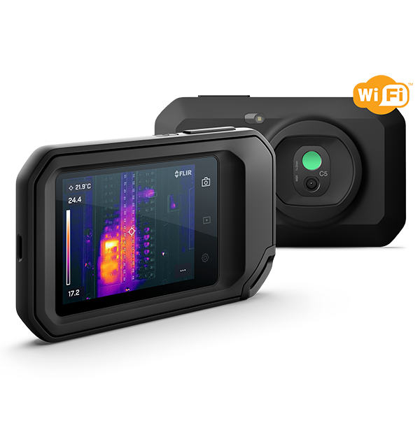
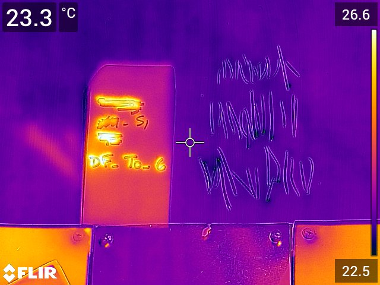

# FLIRカメラで取得した熱画像をRGB画像に変換してみよう

# 1. はじめに

この記事では、FLIR社の赤外線カメラを用いて、取得した画像をRGB画像に変換する方法について述べます。ここでは、Pythonを用います。

赤外線カメラの詳細や、そのカメラの応用事例については以下のページが参考になりました。

[赤外線カメラとは？ドローンでの導入事例やメーカーなどを解説！【2022年最新版】 | 株式会社旭テクノロジー（ATCL） ドローン事業](https://atcl-dsj.com/work/2222/)

本記事では、FLIR社製の赤外線カメラを用います。以下に、そのカメラの例を掲載します。

[サーモグラフィ・赤外線カメラなどのフリアーシステムズ | Teledyne FLIR | Teledyne FLIR](https://www.flir.jp/)

FLIR社の赤外線カメラで取得した画像の例を以下に示します。温度によって、色分けされて示されています。この画像では、約22度から27度の範囲の温度が観測されています。

また、このカメラは、同時にRGB画像（色画像）を取得している場合が多く、この温度情報を持った画像をRGB画像に変換することができます。

その変換は、以下のFLIR Toolsと呼ばれるソフトウェアを用いて行うことができます。FLIR Toolsのインストール方法は以下のページをご覧ください。

[FLIR Toolsのインストール方法](https://flir-jp.custhelp.com/app/answers/detail/a_id/2229/related/1/session/L2F2LzEvdGltZS8xNjYwMTkyNTgwL2dlbi8xNjYwMTkyNTgwL3NpZC9mVVRVZnBVaWN5SU5hdW9tWnJ4NnIlN0U0THlOUDRTc2ZodlltbTZUZUdwOWduOFpjY3pFUGFoY3kzeElJejhObUZBS3luNzVhaVh0VXlsWDFFYnZ6R0M4YTRNM0pCZXRySWJwdko4SDFFNFFIJTdFM3dSM0s3SEdIYXNnJTIxJTIx)

また以下の動画もわかりやすかったです。

[https://www.youtube.com/watch?v=e9G4mkagJxQ](https://www.youtube.com/watch?v=e9G4mkagJxQ)

このソフトウェアを用いて、以下のように、赤外線カメラの画像をRGB画像に変換することができます（以下の図はイメージです）。

また、各ピクセルの持つ温度の値もCSVファイルとして取り出すことができます。

しかし、FLIR Toolsでは、1枚ずつ、読み込み、作業をすることが必要で、大量の画像をまとめて、同じ処理を繰り返すことは難しいです。

そこで、本記事では、以下のレポジトリを用いて、赤外線カメラの画像を、RGB画像に変換し、さらに、温度情報のCSVファイルを自動保存する方法について述べます。

なお、本記事で用いている画像やコードも以下のレポジトリのサンプルを用いています。

[https://github.com/KentaItakura/FLIR_thermal_tools](https://github.com/KentaItakura/FLIR_thermal_tools)

また、このレポジトリは、以下のレポジトリをフォークし、少しアレンジを加えたものになります。

[https://github.com/susanmeerdink/FLIR_thermal_tools](https://github.com/susanmeerdink/FLIR_thermal_tools)

# 2. 環境構築について

## 2.1. Exif toolのダウンロード

exiftoolの概要やそのダウンロードの方法や使い方は以下のページに記載しています。

[exiftoolを用いて写真の位置情報を変更してみよう - kentaPtの日記](https://kentapt.hatenablog.com/entry/2022/08/14/173503)

exiftoolを用いて、赤外線カメラの画像のメタ情報を取得した時の結果の例です。取得したカメラのモデル情報なども記載されていることがわかります。

## 2.2. Pythonの実行環境について

まずは、このレポジトリのファイルをダウンロードします。

[https://github.com/KentaItakura/FLIR_thermal_tools](https://github.com/KentaItakura/FLIR_thermal_tools)

環境構築については、以下の2つの方法を紹介します。

1. 必要なパッケージをインストールする
2. 私の作ったanaconda環境をそのまま自分のPCに複製する

2の方法が簡単ですが、OSの違いなどで複製できない場合もあるため、1から説明します。

## 2.2.1. 必要なパッケージをインストールする

**1. pythonのインストール**

ここでは、python3.7を用いた。OSはWindowsを使用。

**2. flirimageextractorのインストール**

**`pip install flirimageextractor`**

にて、**flirimageextractor**をインストールする

[flirimageextractor](https://pypi.org/project/flirimageextractor/)

**3. その他、コードを実行しながら、必要なパッケージをインストールする**

3章で示すコマンドにて、必要なパッケージを適宜インストールしてください。

### 2.2.2. この記事で用いたanaconda環境をそのまま自分のPCに複製する

さきほど述べたように、以下のレポジトリをダウンロード、または、クローンし、envフォルダの中に`env.yml`が存在していることを確認します。

[https://github.com/KentaItakura/FLIR_thermal_tools](https://github.com/KentaItakura/FLIR_thermal_tools)

以下のページにあるように、

`conda env create -n 新たな環境名 -f ファイル名.yml`

で、環境の複製が可能です。

[Anacondaを使った仮想環境を保存・再構築、複製 - Qiita](https://qiita.com/ozaki_physics/items/13466d6d1954a0afeb3b)

今回の場合は、`env.yml`が存在しているフォルダに移動し、

`conda env create -n myEnv -f env.yml`

を実行することで環境の複製を行うことができます。

# 3. メインコードの実行

## 3.1. exiftoolのパスの設定

demo.pyの35行目周辺に以下のコードがあります。ご自身のexiftoolのパスに置き換えてください。Dドライブではなく、Cドライブにexiftoolを置くほうがよいかもしれません。

**`exiftoolpath = "C:\Program Files (x86)\exif\exiftool.exe”`**

## 3.2. demo.pyの実行

[`demo.py`](http://demo.py) や `[utilities.py](http://utilities.py)` のあるディレクトリで、`demo.py`を実行すると、`Test_Images`フォルダ内の画像に対して、テストコードが実行されます。特に引数の設定は必要ありません。

私はAnaconda環境を用いているため、Anaconda Promptから実行しています。

このコードにより、熱画像からRGB画像およびCSVファイルの保存を行います。

また、以下のような画面が出てくれば、左の赤外線画像と右のRGB画像の順に、右クリックで、対応している点を選びます。できるだけ多くの対応点を選択し、エンターボタンを押してください。

赤外線カメラの画像と、そのRGB画像には、ずれ（offset）があり、補正をする必要があります。上で述べた、exiftoolsをつかって、そのoffset値を読み取ることもできるのですが、必ずしもぴったりといくわけではなく、手動による補正が必要な場合もあるようです。

これにより、FLIR社製の赤外線カメラの画像をRGB画像に変換し、さらに、その温度情報をCSVファイルに書き込むことができます。

# 4. まとめ

この記事では、Pythonを用いて、FLIRの赤外線カメラの画像からRGBおよび、温度情報を表す、CSVファイルを取得することができました。この方法を用いて、経時的に取得した大量の画像や、多視点からの画像を自動的に処理できそうです。